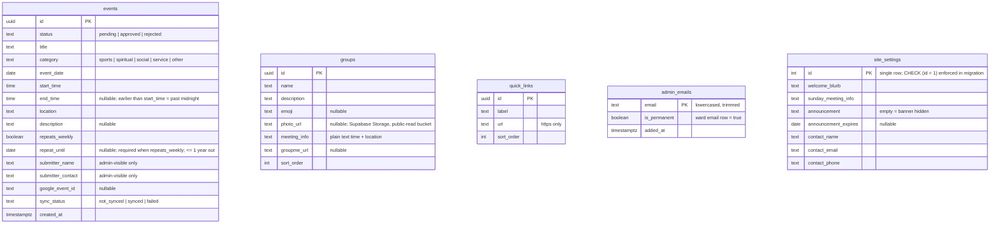

## feat: build Provo YSA 147th Ward website - Extensive

## Overview

Build a warm, mobile-first public website for the Provo YSA 147th Ward: a home page
(welcome blurb, announcement banner, upcoming events, quick links), a hand-built pastel
month calendar (agenda list on phones), and a groups page with GroupMe join links. Anyone
can suggest an event through an open form; events go live only after an admin approves them
from a magic-link-gated admin area, and approved events push one-way to a ward Google
Calendar. Every piece of content is editable through admin forms backed by Supabase so the
site is fully self-sufficient after handoff — no code changes, no paid services, no
credentials tied to one person.

Stack: **Next.js 16 (App Router, TypeScript, Tailwind) + Supabase (Postgres, magic-link
auth, RLS) + googleapis**, deployed on Vercel Hobby at a free `.vercel.app` subdomain.

Source brainstorm: [docs/brainstorm/2026-08-05-ysa-ward-website-brainstorm-doc.md](../brainstorm/2026-08-05-ysa-ward-website-brainstorm-doc.md)

## Problem Statement

The ward has no central place that answers "what's happening and how do I join in."
Information lives in scattered GroupMe threads and word of mouth. Constraints that shape
the solution:

1. **Self-sufficiency after handoff** — YSA leadership turns over constantly. The site must
   run with $0/month, no renewals, and no account tied to a person who will move out.
   Admins are non-developers; normal operation must never require a code change.
2. **Open participation with editorial control** — anyone can suggest an event without an
   account, but nothing appears publicly until an admin approves it.
3. **Warm, mobile-first presentation** — most visitors arrive on phones from GroupMe links.
   The calendar must feel inviting (pastel category chips), not like a corporate tool.
4. **Subscribable calendar** — members should be able to follow the ward Google Calendar;
   approved events must appear there without manual double entry.

## Proposed Solution

Three public surfaces + one admin area, all in a single Next.js app:

- **Home** (`/`): welcome blurb + ward identity + Sunday meeting info (all admin-editable),
  announcement banner (hidden when empty, optional expiry date), next 5 upcoming events,
  quick-links row, button to the calendar.
- **Calendar** (`/calendar`): custom CSS-grid month view on ≥768px with pastel event chips
  (max 3 chips/day, then "+N more"); chronological agenda list grouped by day below 768px.
  Tapping an event opens a detail card (title, category, time, location, description,
  "Add to Google Calendar" link — never submitter contact). Free prev/next month
  navigation. "Suggest an event" button links to `/submit`.
- **Groups** (`/groups`): cards with name, description, emoji (or uploaded photo), meeting
  time + location (plain text), "Join on GroupMe" button (hidden when no link).
- **Submit** (`/submit`): open form — title, category, date, start time, optional end time
  (end < start means "past midnight"), location, description, optional weekly repeat with
  required until-date (≤ 1 year out), submitter name + contact. Honeypot + rate limit +
  server-side zod validation. (The honeypot and rate limit are a deliberate addition
  beyond the brainstorm's "approval queue is the filter" decision — they cost nothing to
  maintain and keep nuisance rows out of the queue; the queue remains the real defense.)
  Confirmation screen sets expectations: "An admin will review this — approved events
  appear on the calendar."
- **Admin** (`/admin`): magic-link login against an `admin_emails` allowlist. Pending queue
  (edit-before-approve, approve, reject-as-status), direct create-event form (skips the
  queue), edit/delete approved events (propagates to Google), groups CRUD, announcement,
  quick links, site settings (blurb, meeting info, escape-hatch contact), allowlist
  management (ward email undeletable at the DB layer). Contact info for help appears here.

**Google Calendar push** is one-way (site → Google), triggered inside the approve/edit/
delete server actions, gated behind an env flag so launch never blocks on ward Google
account access. Push failures never block approval; a per-event sync status and a "Retry
sync" button make recovery a one-click admin task.

## Technical Approach

### Architecture

**Framework decisions (verified current as of 2026-08-05):**

| Concern | Choice | Notes |
|---|---|---|
| Next.js | `next@^16.3` | Turbopack default; async request APIs; `proxy.ts` replaces `middleware.ts`; no implicit caching — fully dynamic rendering is correct for this site |
| Supabase | `@supabase/supabase-js@^2`, `@supabase/ssr@^0.12` | auth-helpers packages are deprecated — do not use. New API key naming: publishable (`sb_publishable_…`) client-side, secret (`sb_secret_…`) server-only |
| Dates | `date-fns@^4` + `@date-fns/tz@^1` (`TZDate`) | `date-fns-tz` is superseded. All date math in America/Denver, DST-aware |
| Google | `googleapis@^174`, scope `calendar.events` | Service account; ward calendar shared directly with the SA email ("Make changes to events") — **no domain-wide delegation needed** |
| Validation | `zod` shared schemas in `lib/validation/` | Same schema client-side (inline errors) and server-side (source of truth) |
| Styling | Tailwind CSS v4 | Pastel palette as CSS custom properties in `globals.css`; grid/agenda breakpoint lives in Tailwind config, not JS |
| Rate limiting | `@vercel/firewall` `checkRateLimit('event-submit')` | Free on Hobby (1 rule); only enforces on Vercel deployments — verify on preview, not locally |
| Testing | Vitest + Testing Library (unit/component); Playwright (E2E); DB integration tests via Supabase CLI local stack | |

**Project layout:**

```
app/
├── layout.tsx                # nav, footer + unofficial-site disclaimer
├── page.tsx                  # home
├── globals.css               # pastel palette, Tailwind
├── unauthorized.tsx          # 401 boundary
├── forbidden.tsx             # 403 boundary
├── calendar/page.tsx
├── groups/page.tsx
├── submit/
│   ├── page.tsx
│   └── actions.ts            # 'use server' — validate + insert pending
├── admin/
│   ├── layout.tsx            # authoritative admin guard (getUser + allowlist)
│   ├── login/page.tsx        # magic-link request form
│   ├── page.tsx              # dashboard: pending queue + sync-failure banner
│   ├── events/
│   │   ├── page.tsx          # all events; edit/delete; direct create
│   │   └── actions.ts        # approve/reject/create/update/delete (+ Google push)
│   ├── groups/page.tsx  + actions.ts
│   ├── content/page.tsx + actions.ts   # announcement, quick links, site settings
│   └── admins/page.tsx  + actions.ts   # allowlist management
├── auth/confirm/route.ts     # GET: verifyOtp({ token_hash, type }) → redirect /admin
└── api/keepalive/route.ts    # daily cron target; requires CRON_SECRET bearer auth
proxy.ts                      # Next 16 proxy: refresh session, fast-redirect /admin/*
lib/
├── supabase/client.ts        # createBrowserClient
├── supabase/server.ts        # createServerClient (cookies getAll/setAll) + requireAdmin()
├── supabase/admin.ts         # secret-key client — server-only imports
├── google/calendar.ts        # SA auth, push/patch/delete, deterministic event IDs
├── events.ts                 # PURE occurrence expansion + upcoming logic — no I/O
├── queries.ts                # Supabase reads for pages (events_public, groups, settings)
├── date.ts                   # TZDate helpers, America/Denver "today", DST-safe math
├── validation/event.ts       # submission schema (incl. honeypot must-be-empty)
├── validation/admin.ts       # group/link/settings/allowlist schemas
└── categories.ts             # category enum + pastel chip colors (coupled, so colocated)
components/
├── ui/                       # Button, Chip, Field, ConfirmDialog, EmptyState
├── calendar/                 # MonthGrid, AgendaList, EventChip, EventDetailCard
└── forms/                    # HoneypotField, SubmitButton
supabase/migrations/          # schema + RLS, version-controlled
tests/db/                     # RLS matrix + action-semantics tests (local stack)
tests/e2e/                    # Playwright
docs/HANDOFF.md               # account custody + runbooks
```

**Layering rule:** components and pure lib modules (`lib/events.ts`, `lib/date.ts`,
`lib/categories.ts`, `lib/validation/*`) never import a Supabase client. All reads go
through `lib/queries.ts`; all writes go through server actions.

**Layered auth (required post-CVE-2025-29927 — never trust middleware alone):**

1. `proxy.ts` — session refresh via `supabase.auth.getClaims()`; redirects
   unauthenticated `/admin/*` requests to `/admin/login`. Convenience layer only.
2. `app/admin/layout.tsx` — authoritative: `getUser()`, then allowlist lookup;
   `unauthorized()` / `forbidden()` boundaries.
3. Every admin server action re-checks admin status independently via `requireAdmin()`
   (actions are independently-invocable POST endpoints).
4. RLS is the final boundary — a non-admin session cannot write any table even calling
   PostgREST directly.

Any change to admin-gating logic must be mirrored across all four layers — this rule is
called out in HANDOFF.md (Phase 9) so it isn't quietly weakened later.

A 403 from a write while signed in means the admin was removed mid-session: the admin UI
shows "Your admin access was removed" and signs out. No token-revocation machinery.

### Data model



**Submitter PII retention (decided):** submitter name/contact are retained indefinitely
and are admin-visible only — they are the only follow-up channel for a submission. No
purge job in v1.

**Recurrence model**: one row per event; occurrences expanded at read time in
`lib/events.ts` by iterating calendar dates with a fixed local time in America/Denver
(never by adding 7×24h to a UTC instant — DST-safe by construction). Pushed to Google as a
single recurring event with `RRULE:FREQ=WEEKLY;UNTIL=<utc>` (UNTIL must be converted to
UTC per RFC 5545), so series edits map to one `patch`. Each occurrence is treated
independently by "upcoming" logic (an event counts as upcoming until its end time; "today"
computed in America/Denver on server and client). No per-occurrence exceptions in v1; the
skip-a-week workaround (end the series early, create a new series after the gap) lives as
in-UI help text next to the recurrence field — HANDOFF.md points to it rather than
duplicating the copy.

### RLS policy matrix (the security model, verbatim)

| Role | events (base table) | events_public (view) | groups / quick_links / site_settings | group-photos bucket | admin_emails |
|---|---|---|---|---|---|
| `anon` | INSERT with `status='pending'` only (`with check` forces it); **no SELECT** | SELECT (approved rows, public columns only) | SELECT only | read only | nothing |
| `authenticated`, non-admin | same as anon | SELECT | same as anon | read only | nothing |
| `authenticated`, admin | ALL | SELECT | ALL | read + insert/update/delete | ALL except deleting `is_permanent` rows |

Implementation notes (each verified against current Supabase/Postgres docs):

- **Submitter privacy via a definer-rights view**: `public.events_public` is a plain
  (default, `security_invoker = false`) view owned by a privileged role, defined as
  `select <public columns only> from events where status = 'approved'`. Because a
  definer-rights view bypasses the base table's RLS, it must never select the submitter
  columns — the column list is itself the privacy boundary. `grant select` on the view to
  `anon, authenticated`; the base table has **no** anon/non-admin SELECT policy or grant,
  so no API path exposes `submitter_name`/`submitter_contact` or pending/rejected rows,
  and a submitter cannot re-read their own pending row. Tests must prove both directions:
  anon **can** read approved rows through the view, and **cannot** read the base table.
- **Admin check**: `private.is_admin()` — `security definer`, `set search_path = ''`
  (schema-qualify `public.admin_emails` inside), in a non-exposed `private` schema,
  comparing lowercased `auth.jwt()->>'email'` against `admin_emails`. Written in plpgsql
  and wrapped as `(select private.is_admin())` in policies for per-statement caching.
- **Ward email permanence**: a `before delete` trigger on `admin_emails` raises when
  `old.is_permanent`, so no UI bug or API call can remove the recovery admin. The UI also
  hides the remove button for that row.
- **Storage**: `group-photos` bucket configured in the migration with public read,
  admin-only write policies, `file_size_limit = 2MB`, and image `allowed_mime_types` —
  the cap is enforced at the bucket, not in client code.
- **Emails normalized** (lowercase, trimmed) on insert and comparison.
- **Approval race**: approve is `update … where id = ? and status = 'pending'`; only the
  winning transition triggers the Google push (no duplicate pushes on double-click). This
  is a database behavior, so it is proven by a DB integration test, not a mocked unit test.
- The secret (service-role) key lives only in `lib/supabase/admin.ts`, imported only by
  server code, used only after an explicit admin check.

### Google Calendar push

- `lib/google/calendar.ts` authenticates with `GOOGLE_SA_CLIENT_EMAIL` +
  `GOOGLE_SA_PRIVATE_KEY` (with `\n` un-escaping), scope
  `https://www.googleapis.com/auth/calendar.events`, target `GOOGLE_CALENDAR_ID`.
- **Feature flag**: sync is enabled iff all three env vars are present. Absent → approvals
  set `sync_status = 'not_synced'` and the site works fully; when credentials land, "Retry
  sync" pushes the backlog. This operationalizes the brainstorm's fallback (ward Google
  account access is an open question) without a second code path.
- **Idempotency**: Google event ID is derived from the Supabase UUID (hyphens stripped —
  hex is valid base32hex) and passed explicitly to `events.insert`; a retry that hits 409
  Conflict is treated as success.
- Approve → `insert`; edit of an approved+synced event → `patch`; delete → `delete`.
  A failed push sets `sync_status = 'failed'`, never blocks the local operation, and
  surfaces as an admin-dashboard banner with the "Retry sync" button. **No automatic
  retry/backoff** — at single-digit approvals/day, the manual retry button is the whole
  recovery story.
- Times sent as local datetime + `timeZone: 'America/Denver'`.
- Every event detail card also renders a template "Add to Google Calendar" link
  (independent of the push, works day one).

### Operational must-dos (canonical list — Dependencies and Risks reference this)

1. **Custom SMTP is a launch prerequisite**: Supabase's built-in mailer allows **2 auth
   emails/hour** (and new free projects can't customize templates) — unusable for
   magic-link login. Configure a free SMTP provider (e.g. Resend free tier) in Supabase
   Auth settings. Document in HANDOFF.md.
2. **Free Supabase projects pause after 7 idle days**: `vercel.json` daily cron (Hobby
   allows exactly once/day) hits `/api/keepalive`, which runs a trivial select. The route
   requires `Authorization: Bearer ${CRON_SECRET}` (Vercel sends it automatically when the
   env var is set) and returns 401 otherwise — no unauthenticated DB-query endpoint.
3. **Magic-link redirect URLs** must be allowlisted in Supabase Auth URL configuration
   (production `.vercel.app` URL).
4. **Vercel WAF rate-limit rule** `event-submit` must be created once in the dashboard
   (Firewall → New Rule) — `checkRateLimit` no-ops locally, so verify on a preview deploy.
5. Non-admin magic-link requests get a generic "If this email is an admin, a link was
   sent" — no allowlist enumeration. Expired/used links land on a friendly error page with
   a "Send a new link" button.

## Implementation Phases

Every phase gates on the uniform baseline
`npm run lint && npx tsc --noEmit && npm run test && npm run build`
(“**baseline**” below), plus phase-specific checks. `npm run test:db` (DB integration:
RLS matrix + action semantics) and `npm run test:e2e` (Playwright) require the Supabase
CLI local stack (`supabase start`).

### Phase 1: Scaffold, design system, and date engine

- **Status:** Done
- **Scope:** Create the Next.js 16 app (TS, Tailwind v4, Vitest). Root layout with nav +
  footer disclaimer, pastel category palette in `lib/categories.ts` + `globals.css`
  (dark-on-pastel chip text verified ≥ 4.5:1; breakpoint in Tailwind config), and the
  fully-tested pure date engine: `lib/date.ts` (TZDate helpers, Denver "today") and
  `lib/events.ts` (weekly recurrence expansion, until-date bound, past-midnight end
  times — pure, no I/O).
- **Files touched:** `package.json`, `next.config.ts`, `app/layout.tsx`, `app/page.tsx`
  (placeholder), `app/globals.css`, `lib/categories.ts`, `lib/date.ts`, `lib/events.ts`,
  `lib/*.test.ts`, `vitest.config.ts`
- **Acceptance criteria:** App builds and serves; date tests cover DST spring/fall
  boundaries, until-date inclusivity, past-midnight display, and Denver-today edges.
- **Validation:** baseline

### Phase 2: Supabase schema, RLS, and clients

- **Status:** Done
- **Scope:** Migrations for all five tables (incl. `site_settings CHECK (id = 1)`), the
  definer-rights `events_public` view (public columns of approved rows only; SELECT
  granted to anon/authenticated; no base-table SELECT for non-admins),
  `private.is_admin()` (security definer, `set search_path = ''`, private schema),
  ward-email delete trigger, and the `group-photos` bucket (public read, admin-only
  write, 2MB `file_size_limit`, image mime types). Supabase client helpers
  (browser/server/admin) + `requireAdmin()`. Zod schemas in `lib/validation/`. Start
  `.env.example` (Supabase vars) and grow it each phase. DB test suite (`npm run
  test:db`) proving every cell of the RLS matrix — including the positive case (anon
  reads approved rows through the view) and storage policies — plus the ward-email
  trigger.
- **Files touched:** `supabase/migrations/0001_schema.sql`, `supabase/config.toml`,
  `supabase/seed.sql`, `lib/supabase/{client,server,admin}.ts`,
  `lib/validation/{event,admin}.ts` + tests, `tests/db/*.test.ts`, `.env.example`,
  `package.json` (`test:db` script)
- **Acceptance criteria:** `supabase start` + migrations apply cleanly; every cell of the
  RLS matrix has a passing test, including submitter-privacy (both directions), storage,
  and ward-email cases.
- **Validation:** baseline `&& npm run test:db`

### Phase 3: Public site — home, calendar, groups

- **Status:** Done
- **Scope:** Server-component pages reading via `lib/queries.ts` (events_public, groups,
  quick_links, site_settings). Home (blurb, banner w/ expiry, next 5 upcoming, quick
  links). Calendar: `MonthGrid` (semantic table, `aria-live` month heading, ≤3 chips/day
  + "+N more", ellipsized titles), `AgendaList` (from today, day-grouped, `<time>`
  elements), `EventDetailCard`, 768px breakpoint, month navigation. Groups cards with
  emoji/photo fallback and conditional GroupMe button. Friendly empty states on every
  surface ("Nothing scheduled yet — suggest an event!").
- **Files touched:** `app/page.tsx`, `app/calendar/page.tsx`, `app/groups/page.tsx`,
  `lib/queries.ts`, `components/calendar/*`, `components/ui/*`, component tests for
  MonthGrid/AgendaList fixtures (recurring, overflow, past-midnight, empty)
- **Acceptance criteria:** All three pages render real Supabase data and every empty state;
  grid↔agenda switch at 768px; chips meet AA contrast; category conveyed by label, not
  color alone.
- **Validation:** baseline + `manual: 1. seed sample data 2. view / , /calendar, /groups at 375px and 1280px 3. clear data and confirm friendly empty states`

### Phase 4: Public event submission

- **Status:** Done
- **Scope:** `/submit` form (all fields incl. weekly-repeat disclosure with required
  until-date ≤ 1 year, helper text "repeats on the same weekday" + in-UI skip-a-week
  note), shared zod validation with inline errors via `useActionState`, honeypot
  (`display:none` **plus** `aria-hidden="true"`, `tabIndex={-1}`, `autocomplete="off"` so
  screen-reader/autofill users never trip it; silent fake success when tripped),
  `@vercel/firewall` rate limit (verified on a preview deployment — it no-ops locally),
  double-submit guard, server action inserting `pending`, confirmation screen with
  expectation-setting copy. "Suggest an event" buttons on calendar + home.
- **Files touched:** `app/submit/{page.tsx,actions.ts}`, `components/forms/*`,
  `lib/validation/event.ts` (finalize), validation tests
- **Acceptance criteria:** Valid submission lands as `pending` (invisible publicly);
  invalid fields show inline errors; past dates, end-before-start (same-day, non-midnight
  case), until-date > 1 year all rejected server-side; honeypot trips return fake success
  with no row.
- **Validation:** baseline + `manual: 1. submit valid event from phone-width viewport, confirm confirmation copy and no public appearance 2. submit with honeypot filled via devtools, confirm no row created 3. on a preview deploy, confirm the rate limit trips`

### Phase 5: Admin auth

- **Status:** Done
- **Scope:** Magic-link login page, `app/auth/confirm/route.ts` (`verifyOtp` with
  `token_hash`), `proxy.ts` session refresh + fast redirect, authoritative
  `app/admin/layout.tsx` guard with `unauthorized()`/`forbidden()` boundaries (verify
  whether Next 16 still gates these behind `experimental.authInterrupts` — if so, enable
  the flag in `next.config.ts`; if unavailable, fall back to `redirect()` + a rendered
  403 page), sign-out, generic non-admin response, expired-link error page with resend,
  removed-mid-session handling (403 → notice → sign-out). Local-stack email capture via
  the CLI's bundled mail catcher (Mailpit on current Supabase CLI; Inbucket on older).
- **Files touched:** `proxy.ts`, `app/admin/{layout.tsx,login/page.tsx}`,
  `app/auth/confirm/route.ts`, `app/{unauthorized,forbidden}.tsx`, `next.config.ts`,
  `lib/supabase/server.ts` (`requireAdmin()` wiring)
- **Acceptance criteria:** Allowlisted email can complete magic-link login to `/admin`;
  signed-in non-admin gets 403; signed-out gets redirected; expired link gets the
  friendly resend page.
- **Validation:** baseline + `manual: 1. log in via magic link with an allowlisted email (local mail catcher) 2. log in with a non-allowlisted email, confirm 403 3. reuse the same link, confirm friendly error`

### Phase 6: Admin event workflow

- **Status:** Not started
- **Scope:** Dashboard with pending queue (oldest first, count badge, full submission
  incl. contact) where items open into an editable form — Approve saves + approves
  atomically (`where status='pending'`), Reject sets status (hidden everywhere,
  preserved). Direct create-event form (writes approved). Edit/delete approved events
  (delete confirms with remaining-occurrence count for series). Every action re-checks
  admin via `requireAdmin()`. DB integration tests (in `test:db`) for the approve-race
  (two concurrent approves → one winner) and for a signed-in non-admin invoking an admin
  action being rejected before the RLS backstop; zod/pure logic as Vitest unit tests.
- **Files touched:** `app/admin/{page.tsx,events/page.tsx,events/actions.ts}`,
  `components/ui/ConfirmDialog.tsx`, `tests/db/actions.test.ts`
- **Acceptance criteria:** Full lifecycle works: submission → edit-before-approve →
  approve → public; reject hides everywhere but persists; direct create skips queue;
  approve-race and non-admin-action tests pass.
- **Validation:** baseline `&& npm run test:db` + `manual: 1. approve a pending event and confirm it appears publicly 2. reject one and confirm it appears nowhere public`

### Phase 7: Admin content & access management

- **Status:** Not started
- **Scope:** Groups CRUD (emoji default, optional photo upload — bucket enforces the 2MB
  cap and mime types; no client-side compression), announcement + expiry, quick links
  (https-validated, ordered), site settings (blurb, meeting info, escape-hatch contact —
  displayed in admin UI), allowlist management (add with normalization + helper text
  "They sign in at /admin with this exact address", remove-self with confirmation,
  permanent row's remove button hidden). Every action re-checks admin.
- **Files touched:** `app/admin/{groups/*,content/*,admins/*}`, validation tests
- **Acceptance criteria:** All content types editable end-to-end; allowlist turnover
  drill passes (add admin → new admin logs in → original removes self; ward email
  undeletable via UI and via direct API call).
- **Validation:** baseline `&& npm run test:db` + `manual: 1. run the turnover drill end-to-end 2. attempt to remove the ward email row (button absent; direct API call fails)`

### Phase 8: Google Calendar sync + operations

- **Status:** Not started
- **Scope:** `lib/google/calendar.ts` (SA auth, deterministic IDs, insert/patch/delete,
  409-as-success — no automatic retry/backoff), wired into Phase 6's approve/edit/delete
  actions behind the env-var flag with `sync_status` transitions, admin sync-failure
  banner + "Retry sync" (also pushes `not_synced` backlog), "Add to Google Calendar"
  template links on detail cards, `/api/keepalive` with `CRON_SECRET` bearer check +
  `vercel.json` daily cron, RRULE UNTIL→UTC conversion tests.
- **Files touched:** `lib/google/calendar.ts` + tests, `app/admin/events/actions.ts`,
  `app/api/keepalive/route.ts`, `vercel.json`, `components/calendar/EventDetailCard.tsx`,
  `.env.example`
- **Acceptance criteria:** With credentials absent, approvals succeed and queue as
  `not_synced`; with credentials, approve/edit/delete round-trip to a real test calendar
  including a weekly RRULE series; simulated push failure leaves the event approved with
  `failed` status and a working retry; keepalive returns 401 without the bearer token.
- **Validation:** baseline + `manual: 1. approve with no Google env vars — site unaffected 2. add test-calendar credentials, retry sync, verify event (and a recurring series) in Google Calendar 3. edit and delete, verify propagation 4. curl /api/keepalive without auth, confirm 401`

### Phase 9: E2E, polish, handoff docs, deploy

- **Status:** Not started
- **Scope:** Playwright E2E against the local stack: submission→approval→public flow;
  non-admin 403; and the automated turnover drill (magic-link login via the local mail
  catcher: add admin B → B signs in → A removes self → ward row shows no remove control).
  Accessibility pass (touch targets, focus states, contrast audit of final palette). SEO
  metadata + OG image + sitemap/robots. `docs/HANDOFF.md`: account custody (ward Google,
  Supabase org under ward email, Vercel), setup runbooks (SMTP, redirect URLs, calendar
  sharing, WAF rate-limit rule, Google key re-setup, resume-paused-project), the
  four-layer auth mirror rule, "edit on the site, never in Google Calendar" note, and a
  pointer to the in-UI skip-a-week help text. `README.md` quickstart. Deploy checklist
  for Vercel + production Supabase (env vars incl. `CRON_SECRET`, WAF rule creation).
- **Files touched:** `tests/e2e/*.spec.ts`, `playwright.config.ts`,
  `app/{sitemap,robots}.ts`, `app/opengraph-image.png`, `docs/HANDOFF.md`, `README.md`,
  `.env.example`
- **Acceptance criteria:** E2E suite green locally (incl. turnover drill); HANDOFF.md
  covers every credential and runbook named above; production deploy live at the
  `.vercel.app` URL with all env vars and the WAF rule.
- **Validation:** baseline `&& npm run test:e2e` + `manual: 1. walk HANDOFF.md as if you were the next admin 2. verify the deployed site on a phone`

## Alternative Approaches Considered

Carried from the brainstorm (see full rationale there):

- **Calendar library (FullCalendar/react-big-calendar)** — rejected: heavyweight,
  restyling costs more than it saves, mediocre mobile story.
- **Google Calendar iframe embed** — rejected: kills the approval workflow, dated look.
- **AI-assisted admin (Claude API)** — rejected deliberately: requires a funded API
  account outliving any member's tenure — the exact single-point-of-failure the site
  designs away. Forms + Supabase leave nothing to fund or expire.
- **Materialized recurrence rows** (one row per occurrence) — rejected in planning:
  expand-at-read keeps series edits to a single row + single Google patch, and the ≤1-year
  until-date bounds expansion cost.
- **Background job/queue or automatic retry for Google sync** — rejected: synchronous
  push in the server action + a manual retry button matches the volume (single-digit
  approvals/day) with zero operational surface.

## Success Criteria

```success-criteria
GOAL: A deployed, self-sufficient ward website where visitors browse events/groups, anyone can suggest events, admins approve and edit all content via forms, and approved events sync to a ward Google Calendar.

SUCCESS CRITERIA:
- Lint, types, unit/component tests, and production build all green | verify: npm run lint && npx tsc --noEmit && npm run test && npm run build
- Recurrence engine is DST-correct: weekly 7 PM series spanning Nov/Mar transitions renders 7 PM Denver on every occurrence and stops at until-date | verify: npm run test -- lib/events
- RLS matrix holds in both directions: anon reads approved rows through events_public but cannot read the base table (no pending/rejected rows, no submitter contact), cannot insert non-pending status; non-admin authenticated cannot write and non-admin action invocations are rejected; permanent admin row cannot be deleted; storage bucket is public-read/admin-write | verify: npm run test:db
- Submission→approval→publication flow, non-admin 403, and the automated turnover drill pass end-to-end | verify: npm run test:e2e
- Google sync: approve/edit/delete propagate to a shared test calendar (incl. RRULE series); with credentials absent or Google failing, approval still succeeds and retry recovers | verify: manual 1. unset Google env vars, approve an event, confirm site unaffected and status not_synced 2. set test-calendar credentials, Retry sync, confirm event + a weekly series appear in Google Calendar 3. edit then delete the event, confirm both propagate
- Turnover drill also passes against production: an admin adds a new admin email, the new admin signs in via magic link, the original removes themselves — entirely through the UI | verify: manual 1. as admin A add admin B 2. sign in as B via magic link 3. as A remove yourself 4. confirm B retains access and the ward email row shows no remove control
- Empty-launch usability: with zero events, groups, links, and announcement, every public page renders intentional friendly copy | verify: manual 1. run against an empty database 2. visit /, /calendar, /groups at phone and desktop widths, confirm no blank regions or errors
- Mobile-first: calendar renders agenda below 768px and grid above; submission completes on a 375px viewport ending on the expectation-setting confirmation | verify: manual 1. resize across 768px on /calendar 2. submit an event at 375px width

NON-GOALS:
- Custom domain, submitter accounts/notifications, per-occurrence recurrence exceptions, biweekly/monthly recurrence, two-way Google sync, CAPTCHA services, client-side image compression, AI/Claude integration, analytics tooling, official Church branding.

VERIFICATION COMMAND: npm run lint && npx tsc --noEmit && npm run test && npm run build && npm run test:db && npm run test:e2e
```

(`test:db` and `test:e2e` require the Supabase CLI local stack: `supabase start`.)

## Success Metrics

- A brand-new admin completes the turnover drill unaided using only HANDOFF.md.
- Event submission from a phone takes under a minute.
- Zero code changes required for any content operation across a semester of use.
- $0/month total operating cost.

## Dependencies & Prerequisites

| Dependency | Status | Blocking? |
|---|---|---|
| Ward Google account access (Cloud project, SA key, calendar created + shared) | Open question — owner TBD | No — sync is env-flag-gated; "Add to Google Calendar" links work day one |
| Supabase project **created under the ward email org** | To do at setup | Yes for deploy (not for local dev — CLI local stack) |
| Custom SMTP for auth emails — see Operational must-do 1 | To do at setup | Yes for production magic-link login |
| Vercel account + Hobby project, incl. WAF rate-limit rule — see Operational must-do 4 | To do at deploy | Yes for deploy |
| Ward email inbox custody documented | To do in HANDOFF.md | No |

## Risk Analysis & Mitigation

(Operational details canonical in "Operational must-dos" above.)

| Risk | Likelihood | Impact | Mitigation |
|---|---|---|---|
| Supabase free project pauses after 7 idle days | High without mitigation | Site down until manual resume | Daily keep-alive cron (Phase 8); resume runbook in HANDOFF.md |
| Magic-link emails throttled/undelivered | High with default mailer | Admins locked out | Custom SMTP prerequisite (must-do 1) |
| RLS misconfiguration leaks submitter contact or pending rows | Low with tests | Privacy breach | Definer-view with explicit column list, default-deny base table, both-direction DB test suite (Phase 2) |
| CVE-class middleware bypass | Low | Admin exposure | Four-layer auth; RLS as final boundary |
| Google credentials lapse post-handoff | Medium | Stale ward calendar | `sync_status` banner makes failure visible; re-setup runbook; site itself unaffected |
| Ward Google account access never materializes | Medium | No subscribable calendar | Env-flag fallback + per-event Add-to-Calendar links |
| Spam floods pending queue | Medium | Admin nuisance only | Honeypot + rate limit + queue-as-filter; nothing spam reaches the public |
| DST bugs in hand-rolled recurrence | Medium | Wrong event times | TZDate calendar-date iteration + explicit DST boundary tests |
| Admin locks everyone out | Low | Recovery needed | DB-enforced permanent ward email row |

## Resource Requirements

- One developer (AI-assisted) — 9 phases, each sized to one `/build` context window. No
  paid services: Vercel Hobby, Supabase Free, Google Calendar API free tier, SMTP free
  tier.

## Future Considerations

- Per-occurrence cancellations ("no FHE this Monday") as a `cancelled_dates` array.
- Cancelled-badge display state instead of hard delete.
- Client-side image compression if group-photo weight ever matters.
- Photo galleries or a linger-activity signup sheet.
- Custom domain if the ward ever wants one (explicitly out of scope now).

## Documentation Plan

- `README.md` — local dev quickstart (`supabase start`, env vars, `npm run dev`).
- `docs/HANDOFF.md` — the load-bearing document: account custody (ward Google, Supabase,
  Vercel), setup runbooks (SMTP, redirect URLs, calendar sharing, WAF rule, SA key
  rotation, resume-paused-project), the four-layer auth mirror rule, and operational
  notes (edit on the site not in Google; pointer to in-UI skip-a-week help).
- `.env.example` — every env var with a comment, grown per phase from Phase 2.
- Admin-facing help text lives in the admin UI itself, not in docs a non-developer won't
  find (recurrence helper text, skip-a-week workaround, allowlist helper text).

## References & Research

### Internal References

- Brainstorm (decisions + rationale): `docs/brainstorm/2026-08-05-ysa-ward-website-brainstorm-doc.md`
- User-flow gap analysis (2026-08-05, agent report): resolved blockers folded into this
  plan — event detail surface, submission entry/confirmation, reject-as-status,
  edit-before-approve, Google edit/delete propagation, RLS-enforced allowlist,
  DB-enforced ward email, decoupled sync, expand-at-read recurrence with required
  ≤1-year until-date.
- Plan review (2026-08-05, three agents): critical view-rights fix (definer view for
  public reads), uniform phase gates, explicit DB test harness, Phase 6 split, keepalive
  auth, and simplicity cuts (no auto-retry, no client compression) — all applied above.

### External References

- Next.js 16: https://nextjs.org/docs/app — proxy.ts file convention, async request APIs, unauthorized()/forbidden() (check authInterrupts status), Vitest guide
- Supabase SSR auth: https://supabase.com/docs/guides/auth/server-side/nextjs — token_hash + verifyOtp pattern; https://supabase.com/docs/guides/getting-started/migrating-to-new-api-keys
- Supabase RLS: https://supabase.com/docs/guides/database/postgres/row-level-security; Postgres view security (definer vs invoker): https://www.postgresql.org/docs/current/sql-createview.html
- Supabase limits: https://supabase.com/docs/guides/auth/rate-limits (2 emails/hr default); project pausing after 7 idle days
- Google Calendar API: https://developers.google.com/workspace/calendar/api/concepts/sharing (SA sharing, no DWD); https://developers.google.com/workspace/calendar/create-events (client-supplied IDs); https://developers.google.com/workspace/calendar/api/guides/quota
- date-fns v4 + @date-fns/tz: https://blog.date-fns.org/v40-with-time-zone-support/
- Vercel Hobby limits + cron (1×/day): https://vercel.com/docs/limits; rate limiting on Hobby: https://vercel.com/changelog/rate-limiting-now-available-on-hobby-with-higher-included-usage-on-pro; cron auth via CRON_SECRET: https://vercel.com/docs/cron-jobs/manage-cron-jobs
- CVE-2025-29927 (middleware bypass → layered auth): https://advisories.gitlab.com/pkg/npm/next/CVE-2025-29927/
- WCAG contrast for pastel chips: https://developer.mozilla.org/en-US/docs/Web/Accessibility/Guides/Understanding_WCAG/Perceivable/Color_contrast
- ARIA calendar-grid semantics: https://www.w3.org/WAI/ARIA/apg/

### Related Work

- None — greenfield repository.
