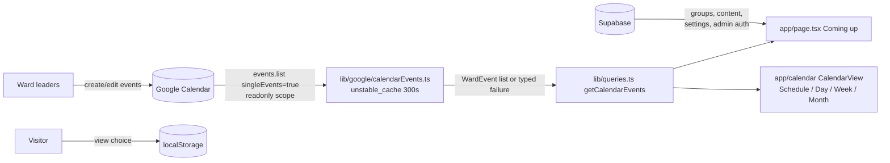

## feat: GroupMe banner, survey stub, calendar views, Google Calendar as source of truth - Extensive

## Overview

Four related changes that reshape how the site presents and sources events:

1. **Homepage**: a visually distinct "Join the Ward GroupMe" hero banner card above the H1
   (linking to https://groupme.com/join_group/96448094/VfvOov1r), and a "New Member Survey"
   link (to a new placeholder `/survey` page) replacing the "Suggest an event" blurb. The
   "Coming up" section stays.
2. **Remove the public suggest-an-event flow**: `/submit` page, form, server action,
   validation schema, nav link, sitemap entry — all deleted, with a permanent redirect from
   `/submit` to `/`.
3. **Calendar view switcher**: Schedule / Day / Week / Month views on `/calendar`, built by
   extending the existing hand-rolled components. Choice persists in localStorage; first
   visit defaults to Month on desktop and Schedule on mobile.
4. **Flip the event data flow**: the ward's Google Calendar becomes the source of truth. The
   site reads events server-side from the Google Calendar API (cached ~5 minutes) instead of
   Supabase. The site→Google push, admin event screens, approval queue, sync banner, and
   Supabase `events`/`events_public` tables all retire. Event categories map from Google
   event colors.

Source brainstorm: [docs/brainstorm/2026-08-14-groupme-survey-calendar-flip-brainstorm-doc.md](../brainstorm/2026-08-14-groupme-survey-calendar-flip-brainstorm-doc.md)

## Problem Statement

The ward's leaders manage events in Google Calendar, not on the site — the current
architecture (Supabase as source of truth, one-way push to Google, public suggestion queue)
inverts how the ward actually works and carries admin/sync infrastructure nobody uses. At
the same time the homepage buries the single most useful action for a new member (joining
the ward GroupMe), and the calendar offers only one view per device class.

Constraints carried over from the original build:

- **Self-sufficiency after handoff** — $0/month, non-developer admins, no code changes for
  normal operation. Reading from Google Calendar *improves* this: event management moves to
  a tool leaders already know.
- **Warm, mobile-first presentation** — the pastel category chips survive the flip via a
  Google-color→category mapping.
- **The site must never hard-fail because Google is slow or down** — same philosophy the
  push sync had, now applied to reads.

## Proposed Solution

### Homepage (`app/page.tsx`)

- New `GroupMeBanner` section rendered above the `<h1>` — a distinct card (accent
  background, larger padding) with a short line of copy and a prominent "Join the Ward
  GroupMe" button (`ButtonLink`, `target="_blank"`). Rendered as a labeled `<section>`
  (`aria-label`), **not** a heading, so the page outline still starts at the H1.
- The GroupMe URL lives in `lib/site.ts` as an exported constant (`GROUPME_JOIN_URL`) so
  the banner and any empty-state copy share one definition.
- The "Suggest an event" secondary button becomes "New Member Survey" → `/survey`.
- Empty-state copy in "Coming up" no longer points at `/submit`; it points at the GroupMe
  ("Know about something? Share it in the ward GroupMe.").

### `/survey` placeholder (`app/survey/page.tsx`)

- Static page: title "New Member Survey", one paragraph — the survey is coming soon; in the
  meantime say hi in the ward GroupMe (link). `metadata` with title; **excluded** from
  `app/sitemap.ts` until the real survey exists.

### Remove the suggestion flow

- Delete `app/submit/` (page, `actions.ts`, `submit-state.ts`),
  `components/forms/SubmitEventForm.tsx` (+test), `components/forms/HoneypotField.tsx`
  (only the submit form uses it), `lib/validation/event.ts` (+test — first inline its
  `MAX_REPEAT_DAYS` constant into `lib/validation/adminEvent.ts`'s replacement… see Phase 4;
  in Phase 1 `adminEvent.ts` still imports it, so the deletion of `event.ts` moves the
  constant into `adminEvent.ts`).
- Remove the nav link (`app/layout.tsx:38`), the sitemap entry (`app/sitemap.ts:12`), and
  the calendar-page header button (`app/calendar/page.tsx:28` — becomes nothing; the page
  keeps just its H1).
- Add a permanent redirect `/submit` → `/` in `next.config.ts` (`redirects()`), so old
  bookmarks and indexed links don't 404.
- Delete `tests/e2e/submission.spec.ts`.

### Calendar view switcher (`components/calendar/`)

**Views** — all client-side over the same server-fetched event list:

| View | Rendering | Navigation |
|---|---|---|
| Schedule | Existing `AgendaList` — forward from today, grouped by day | none (scroll) |
| Day | `AgendaList` restricted to one day (anchor date), with an explicit empty state | Prev / Today / Next buttons (client state) |
| Week | `AgendaList` over the anchor date's Sun–Sat week | Prev / This week / Next (client state) |
| Month | Existing `MonthGrid` | Existing `?month=` URL links (unchanged) |

- New pure helpers in `lib/date.ts` (+tests in `lib/date.test.ts`): `weekRange(date)`
  (Sun–Sat inclusive range containing a date) and `formatWeekLabel(range)`
  (`"Aug 16 – 22, 2026"`). Day labels reuse `formatDayLabel`. All reuse the existing
  DST-safe calendar-date arithmetic.
- `ViewSwitcher` component: four real `<button type="button">`s in a
  `<div role="group" aria-label="Calendar view">`, each with
  `aria-pressed={view === value}`, styled as a segmented control with the existing button
  conventions (44px touch targets). No tablist/radiogroup — matches the repo's minimal-ARIA
  style and needs no custom key handling.
- **Preference resolution** (local state + effect inside `CalendarView.tsx` — no separate
  hook file; the state has a single consumer):
  - State starts `null` on server and first client render → `CalendarView` renders the
    **existing CSS dual layout** (grid `hidden md:block`, agenda `md:hidden`), which *is*
    the smart default (Month on desktop, Schedule on mobile) with zero hydration risk.
  - A `useEffect` on mount resolves the effective view:
    `?month=` present in the URL → `"month"` (an explicit URL beats a remembered
    preference); else `localStorage["calendar-view"]` if it holds a valid view name; else
    `matchMedia("(min-width: 768px)")` → `"month"` : `"schedule"`. Resolution triggers one
    client-only re-render into explicit single-view mode.
  - Choosing a view writes `localStorage` (wrapped in try/catch — private mode); invalid or
    stale stored values fall back to the device default.
  - Anchor date for Day/Week: component state initialized to today (or the first day of
    `?month=` if present). Not URL-persisted — refresh returns to today. (Deliberate
    simplification; see Non-Goals.)
- Month prev/next `ButtonLink`s render only in Month view. Empty states exist per view
  (empty day, empty week, empty schedule, empty month) with copy that points at the
  GroupMe, not `/submit`.
- Component tests (`CalendarView.test.tsx` or `ViewSwitcher.test.tsx`): switcher renders
  four options, switching swaps the view and sets `aria-pressed`, choice lands in
  localStorage, day/week navigation moves the anchor, `?month=` forces Month. jsdom has no
  `matchMedia` — stub it in the test setup and cover both device-default resolutions
  (matches → Month, doesn't → Schedule).

### Google Calendar as the source of truth

**New read module `lib/google/calendarEvents.ts`** (replaces `lib/google/calendar.ts`;
named to sit beside the surviving `calendarLink.ts` and avoid an import clash with
`lib/events.ts`):

- Reuses the existing credentials pattern (`GOOGLE_SA_CLIENT_EMAIL`,
  `GOOGLE_SA_PRIVATE_KEY` with `\n` normalization, `GOOGLE_CALENDAR_ID`), with scope
  narrowed to `https://www.googleapis.com/auth/calendar.events.readonly`. The calendar
  share to the service account can drop from "Make changes to events" to
  **"See all event details"** (not free/busy — that hides titles).
- Query: `events.list({ singleEvents: true, orderBy: "startTime", timeMin, timeMax,
  maxResults: 2500 })` with a `pageToken` loop (kept trivially small — accumulate `items`,
  loop on `nextPageToken`; purely precautionary, a ward calendar will never approach 2500
  items in the window). Window: **3 months back to 13 months forward** of today (RFC3339
  with offset) — enough for "last month" browsing and the full forward horizon the agenda
  shows today; older months show the normal empty state (a documented non-goal). Google
  expands recurring events into instances, so the site's own weekly-recurrence expansion
  retires.
- **Pure mapping layer** (exported for tests, no I/O — same pattern as the old
  `buildEventBody`): `mapGoogleEvent(item) → WardEvent[]`:
  - Timed events: convert `start.dateTime`/`end.dateTime` to ward-zone `eventDate` /
    `startTime` / `endTime` via `TZDate`. Past-midnight events land in the existing
    end-before-start encoding. Timed events longer than 24h render on their start day only
    (accepted limitation for a ward calendar).
  - All-day events (`start.date`/`end.date`, end exclusive): one `WardEvent` per covered
    day with a new `allDay: true` flag; views render "All day" instead of a time range
    (`formatTimeRange` gains the case).
  - Filter `status === "cancelled"`; untitled events fall back to `"(No title)"`;
    `description` is stripped of HTML tags (Google allows HTML; the site renders plain
    text).
  - `id` = the Google instance id (stable per instance), so occurrence keys (`id@date`)
    stay stable. `WardEvent.id` is **not** assumed unique across the list — a multi-day
    all-day event maps to several `WardEvent`s sharing one id, and the occurrence key is
    the only unique handle. Multi-day events render as a plain "All day" row on each
    covered day, with no "continues"/"day 2 of 3" treatment (accepted simplification).
  - Attendee, organizer, and creator fields are **never** mapped — the site shows only
    title, category, date/times, location, and description. One mapping test feeds a
    fixture containing organizer/attendees and asserts none of it reaches `WardEvent`
    (the successor to the old `events_public` privacy boundary).
  - In this phase `repeatsWeekly`/`repeatUntil` **stay on the `WardEvent` type** (mapped
    events always set `false`/`null`) because `components/admin/EventManager.tsx` still
    constructs recurring `WardEvent`s until Phase 4 deletes it. The type narrowing,
    `expandEvent` weekly-branch removal, and `UPCOMING_HORIZON_DAYS` retirement (the
    display horizon collapses into the fetch window) all happen in **Phase 4** so every
    phase compiles. The `EventOccurrence` wrapper (key, resolved start/end instants,
    `endsNextDay`) is kept deliberately — `MonthGrid`, `AgendaList`, and
    `EventDetailCard` are built on it, and collapsing it buys little; accepted residual
    complexity.
- **Category from color** (pure, in `lib/categories.ts` +tests): `colorId` → category by
  hue, so the chip roughly matches whatever the leader picked in Google Calendar:

  | Google color (`colorId`) | Category |
  |---|---|
  | Sage (2), Basil (10) | sports (green chip) |
  | Lavender (1), Grape (3) | spiritual (purple chip) |
  | Flamingo (4), Banana (5), Tangerine (6), Tomato (11) | social (warm chip) |
  | Peacock (7), Blueberry (9) | service (blue chip) |
  | Graphite (8), unset | other (neutral chip) |

  The mapping is documented for leaders in `docs/HANDOFF.md`.
- **Caching and failure**: the raw fetch is wrapped in
  `unstable_cache(fetchGoogleEvents, ["ward-calendar-events"], { revalidate: 300 })`
  (supported in Next 16; `cacheComponents` is *not* enabled for this — it's a whole-app
  rendering-model change). The API call carries an explicit **request timeout (~5s)** so a
  slow Google can't hang page renders — a timeout counts as a failure like any other. The
  cached function **throws** on API failure so failures are never cached (a transient
  hiccup self-heals on the next request); the public entry point `getCalendarEvents()`
  catches and returns a typed result
  `{ ok: true; events: WardEvent[] } | { ok: false }` — mirroring the old `SyncResult`
  philosophy that a Google outage must never take the site down.
- `lib/queries.ts` `getPublicEvents()` is replaced by `getCalendarEvents()` (its module
  docstring about `events_public` privacy is rewritten in the same change); the homepage
  and calendar page render the events region from it — on `ok: false` (or missing
  credentials) they render an `EmptyState` "The calendar isn't loading right now — try
  again in a few minutes." while nav, announcement, quick links, and groups render
  normally.
- **Test fixture seam**: when `CALENDAR_FIXTURES` (path to a JSON array of Google event
  items) is set **and** `NODE_ENV !== "production"`, `lib/google/calendarEvents.ts` maps
  the fixture file through the same pure `mapGoogleEvent` instead of calling the API — the
  production guard means a stray env var can never serve canned data to real visitors.
  This is what keeps `tests/e2e/public.spec.ts`'s event interactions (detail card, chips,
  views) meaningful without live Google credentials; documented as test-only.
- Unit tests `lib/google/calendarEvents.test.ts`: fixture-driven mapping tests — timed,
  past-midnight, all-day single, all-day multi-day (end exclusive!), cancelled, missing
  title/location/description, HTML description, colorId present/absent, non-ward event
  time zone, DST-boundary instance, organizer/attendees never surfaced.

### Retire the write path, admin event screens, and events tables

- Delete: `lib/google/calendar.ts` (+`calendar.test.ts`, `push.test.ts`),
  `app/admin/(protected)/events/` (page, actions, action-state),
  `app/admin/(protected)/page.tsx`'s queue (see below), `components/admin/PendingQueue.tsx`,
  `EventManager.tsx`, `EventFields.tsx`, `SyncBanner.tsx`, `lib/adminQueries.ts`,
  `lib/validation/adminEvent.ts` (+test). `lib/google/calendarLink.ts` (the per-event
  "Add to Google Calendar" template link) is pure and self-contained — it survives
  unchanged, as does the subscribable-calendar quick link (a DB row, not code).
- `/admin` dashboard becomes a simple landing: "Events are managed in the ward Google
  Calendar" card with a link to calendar.google.com, plus the existing nav (Groups /
  Content / Admins). Admin nav loses Queue and Events entries.
- New migration `supabase/migrations/0002_drop_events.sql`: drop `events_public` view and
  `events` table (policies/grants/indexes go with them). `supabase/seed.sql` loses its
  events inserts. `tests/db/` loses the events-related suites (`actions.test.ts` events
  sections, `rls.test.ts` events/`events_public` sections, helpers); admin-emails, groups,
  content, and turnover coverage stays.
- e2e updates: `public.spec.ts` gains switcher coverage and runs against
  `CALENDAR_FIXTURES`; `access.spec.ts` unchanged (admin auth still Supabase);
  `submission.spec.ts` already deleted in Phase 1.
- The keepalive cron **stays** — groups, content, settings, and admin auth still live in
  Supabase.
- Docs: `docs/HANDOFF.md` — rewrite "Approving events" / "Repeating events" / sync-banner
  sections into "Managing events in Google Calendar" (color→category table, ~5-minute
  propagation note, sharing requirements, scope), update env-var table (Google vars now
  required for events to appear), note the Vercel `event-submit` firewall rule can be
  deleted; `README.md` — update the intro, layout notes, and env description.

### Deployment sequencing (manual, documented in the plan and HANDOFF)

Steps 1–2 are a **pre-merge gate for Phase 3** (the read flip goes live the moment Phase 3
reaches `main`, and the backfill audit needs the admin sync-status screen, which Phase 4
deletes). Step 4 is a **post-verification step of Phase 4**.

1. **Backfill check first**: every future event the site currently shows must exist in
   Google Calendar. The old push sync created most of them — verify in the admin screen
   (sync status "synced") *before* merging Phase 3, and hand-enter any that aren't.
2. Confirm the calendar is shared with the service account (at least "See all event
   details").
3. Deploy the flip (merge Phase 3).
4. Run the drop migration (`npx supabase db push`) after the deployed flip is verified —
   the table drop is the last, irreversible step.

## Technical Approach

### Data flow after the flip



### Key facts verified against official docs (2026-08-14)

- `orderBy: "startTime"` requires `singleEvents: true`; instance ids are stable;
  `timeMin` bounds an event's *end*, `timeMax` its *start* (both exclusive) — an in-window
  slice of a long event is still returned. `maxResults` max 2500, paginate via
  `nextPageToken`. ([events.list](https://developers.google.com/calendar/api/v3/reference/events/list))
- All-day events use `start.date`/`end.date` with **exclusive** end; `description` may
  contain HTML; `status: "cancelled"` must be filtered; `colorId` values 1–11 (Lavender,
  Sage, Grape, Flamingo, Banana, Tangerine, Peacock, Graphite, Blueberry, Basil, Tomato),
  absent when the event uses the calendar default color. ([events resource](https://developers.google.com/calendar/api/v3/reference/events))
- `calendar.events.readonly` suffices for `events.list` on a calendar shared with the
  service account; quotas (600 req/min/user) are irrelevant at this traffic with a 5-min
  cache. ([scopes](https://developers.google.com/identity/protocols/oauth2/scopes#calendar))
- `unstable_cache` is supported in Next 16 (recommended path for projects *not* opting into
  Cache Components); composes with dynamic (cookie-reading) pages — the Supabase reads keep
  the route dynamic while the Google result comes from the Data Cache. Error-on-throw
  stale-serving is **not** guaranteed by the docs, hence the explicit throw-then-catch
  design where failures are never cached. ([unstable_cache](https://nextjs.org/docs/app/api-reference/functions/unstable_cache), [caching without Cache Components](https://nextjs.org/docs/app/guides/caching-without-cache-components))

### Institutional learnings honored

- Pure modules stay pure: mapping, category-from-color, and week-range logic are all
  I/O-free and hard-tested; the thin `events.list` wrapper stays untested by Vitest —
  exactly the `calendar.test.ts` precedent ("mocking googleapis would prove nothing").
- Reads keep going through `lib/queries.ts`; pages never touch googleapis directly.
- A Google failure degrades one region, never the page — the `SyncResult` philosophy,
  ported to reads. Supabase failures keep their existing site-down semantics.
- DST safety: all new date math (week ranges, day navigation, Google `dateTime`→ward-day
  conversion) goes through `lib/date.ts`'s calendar-date arithmetic and `TZDate`.

## Implementation Phases

> Scope review (2026-08-14): the work is too large for one well-reviewed PR. Phases 1 and
> 2 each merge standalone; Phases 3 and 4 ship together (the site reading Google while
> admin write screens still exist is acceptable only transitionally, not as a merged state
> on `main`). Each phase leaves the repo compiling and green.

### Phase 1: Homepage, survey stub, remove the suggestion flow

- **Status:** Done
- **Scope:** GroupMe banner card, "New Member Survey" link + `/survey` placeholder page,
  delete the `/submit` flow end to end, permanent redirect, nav/sitemap/empty-state
  updates.
- **Files touched:** `app/page.tsx`, `app/survey/page.tsx` (new), `app/layout.tsx`,
  `app/sitemap.ts`, `next.config.ts`, `lib/site.ts`, `README.md` (intro + layout map — no
  suggestion flow); deletions: `app/submit/*`,
  `components/forms/SubmitEventForm.tsx` (+test), `components/forms/HoneypotField.tsx`,
  `lib/validation/event.ts` (+test, with `MAX_REPEAT_DAYS` moved into
  `lib/validation/adminEvent.ts`), `tests/e2e/submission.spec.ts`; `tests/e2e/public.spec.ts`
  (banner assertion, `/submit`-redirects-to-`/` assertion, no suggest-an-event
  assertions).
- **Acceptance criteria:** Homepage shows the GroupMe banner above the H1 and a New Member
  Survey link; `/survey` renders; `/submit` permanently redirects to `/` (asserted in
  e2e); `grep -rn '"/submit"' app components lib` finds nothing.
- **Validation:** `npm run lint && npx tsc --noEmit && npm run test && npm run build && npm run test:e2e`

### Phase 2: Calendar view switcher

- **Status:** Not started
- **Scope:** Schedule/Day/Week/Month switcher with localStorage persistence, smart
  defaults, day/week navigation, per-view empty states, a11y semantics, and tests. Data
  source unchanged (still Supabase) — this phase is pure presentation. Deliberately
  ordered before the Google flip: the switcher is shippable regardless of the flip's
  credential/backfill gating, and Phase 3's rework of the views is one additive all-day
  label, not a reshape.
- **Files touched:** `components/calendar/CalendarView.tsx` (view/anchor state lives
  here — no separate hook file), `components/calendar/ViewSwitcher.tsx` (new),
  `components/calendar/CalendarView.test.tsx` (new; stubs `window.matchMedia`),
  `lib/date.ts` (+ `lib/date.test.ts`): `weekRange`, `formatWeekLabel`;
  `app/calendar/page.tsx` (pass month param through); `tests/e2e/public.spec.ts`
  (switcher smoke: fresh `/calendar` at both viewports asserts the default view and no
  console errors — the machine check for hydration health).
- **Acceptance criteria:** Four views switchable; choice survives reload via localStorage;
  first visit shows Month ≥768px / Schedule below, with the e2e console-error assertion
  standing in for "no hydration warning"; `?month=` deep link lands in Month view;
  day/week prev/next navigate; every view has an empty state.
- **Validation:** `npm run lint && npx tsc --noEmit && npm run test && npm run build && npm run test:e2e`

### Phase 3: Google Calendar read path

- **Status:** Not started
- **Scope:** `lib/google/calendarEvents.ts` (fetch + timeout + pure mapping +
  `unstable_cache` + typed failure + guarded fixture seam), color→category mapping,
  `allDay` support in the event model and views, repoint `lib/queries.ts` (docstring
  rewrite included), graceful-degradation empty states, mapping unit tests, e2e fixtures.
  `WardEvent` keeps `repeatsWeekly`/`repeatUntil` this phase (mapped events set
  `false`/`null`) so the still-present admin screens compile; the type narrowing happens
  in Phase 4.
- **Files touched:** `lib/google/calendarEvents.ts` (new),
  `lib/google/calendarEvents.test.ts` (new), `lib/categories.ts` (+test), `lib/events.ts`
  (`allDay` flag only), `lib/date.ts` (`formatTimeRange` all-day case), `lib/queries.ts`,
  `app/page.tsx`, `app/calendar/page.tsx`, `components/calendar/*` (allDay rendering),
  `tests/e2e/public.spec.ts` + `tests/e2e/fixtures/calendar-events.json` (new),
  `playwright.config.ts` (`CALENDAR_FIXTURES` env for the dev server).
- **Acceptance criteria:** With `CALENDAR_FIXTURES` set, homepage and all four calendar
  views render fixture events with correct chips, times, all-day labels; with no
  credentials and no fixture, both pages render the friendly unavailable state and
  everything else still works; mapping tests cover the fixture matrix (timed, past-
  midnight, all-day multi-day, cancelled, HTML description, colorId, DST,
  organizer/attendees excluded). **Pre-merge gate:** deployment-sequencing steps 1–2
  (backfill audit in the admin sync screen, calendar-share check) are complete.
- **Validation:** `npm run lint && npx tsc --noEmit && npm run test && npm run build && npm run test:e2e`

### Phase 4: Retire the write path, admin event screens, events tables, and docs

- **Status:** Not started
- **Scope:** Delete push sync, admin queue/event screens, sync banner, admin event
  validation; narrow `WardEvent` (drop `repeatsWeekly`/`repeatUntil`), remove
  `expandEvent`'s weekly branch and `UPCOMING_HORIZON_DAYS` (display horizon = fetch
  window); new `/admin` landing; drop migration + seed update; trim db tests; rewrite
  HANDOFF/README event sections including the deployment sequencing runbook.
- **Files touched:** deletions: `lib/google/calendar.ts` (+`calendar.test.ts`,
  `push.test.ts`), `app/admin/(protected)/events/*`, `components/admin/PendingQueue.tsx`,
  `EventManager.tsx`, `EventFields.tsx`, `SyncBanner.tsx`, `lib/adminQueries.ts`,
  `lib/validation/adminEvent.ts` (+test); modified: `lib/events.ts` (+test — type
  narrowing and expansion simplification), `components/calendar/CalendarView.tsx`
  (agenda range from the fetch window), `app/admin/(protected)/page.tsx`,
  `app/admin/(protected)/layout.tsx`, `supabase/migrations/0002_drop_events.sql` (new),
  `supabase/seed.sql`, `tests/db/actions.test.ts`, `tests/db/rls.test.ts`,
  `tests/db/helpers.ts`, `docs/HANDOFF.md`, `README.md`.
- **Acceptance criteria:** No references to `events`/`events_public`/sync remain in app
  code (`grep -rn "events_public\|sync_status\|adminQueries" app components lib` is
  empty); `/admin` renders the new landing; db and e2e suites green against the migrated
  schema.
- **Validation:** `npm run lint && npx tsc --noEmit && npm run test && npm run build && npm run test:db && npm run test:e2e`

## Alternative Approaches Considered

- **Calendar library (react-big-calendar / FullCalendar)** — rejected in the brainstorm:
  bundle weight and Tailwind v4 restyling for capabilities a ward calendar doesn't need;
  the hand-rolled components are small, styled, and tested.
- **Cron sync Google→Supabase** — rejected: keeps the old read path but adds sync
  infrastructure, failure modes, and staleness for no user-visible benefit over a 5-minute
  read cache.
- **Keep the site's own recurrence expansion** (fetch with `singleEvents: false`) —
  rejected: Google's RRULE space (exceptions, moved instances, non-weekly rules) is far
  bigger than the site's weekly-only model; `singleEvents: true` makes Google do it
  correctly and deletes code.
- **`"use cache"` / Cache Components** — rejected for now: opt-in flag changes the whole
  app's rendering model; `unstable_cache` is the documented path for projects not opting
  in, and the migration later is mechanical.
- **Tag-in-title category mapping** — rejected by the user in planning in favor of Google
  event colors (no text clutter, natural Google UI).
- **URL-persisted day/week anchor (`?date=`)** — deliberately skipped: refresh-returns-to-
  today is acceptable for a ward site and keeps the switcher purely client-side; `?month=`
  URL navigation (the shareable case that exists today) stays.
- **`useSyncExternalStore` / inline-script preference bootstrap** — rejected: the
  mounted-gate state has zero hydration risk because the pre-resolution render *is* the
  correct smart default (the existing CSS breakpoint layout); a brief flash only affects
  returning visitors who chose a non-default view.
- **Collapsing `EventOccurrence` into `WardEvent`** once Google pre-expands recurrence —
  rejected: `MonthGrid`, `AgendaList`, and `EventDetailCard` are built on the occurrence
  shape (stable key, resolved start/end instants, `endsNextDay`), and collapsing it would
  rework every view for no user-visible gain. Kept as documented residual complexity.

## Success Criteria

```success-criteria
GOAL: The homepage leads with a GroupMe join banner and a survey link, the suggestion flow is gone, the calendar offers Schedule/Day/Week/Month views with a remembered choice, and all events on the site come from the ward's Google Calendar with the admin/Supabase event pipeline fully retired.

SUCCESS CRITERIA:
- Lint, types, unit/component tests, and production build all green | verify: npm run lint && npx tsc --noEmit && npm run test && npm run build
- Google event mapping is correct across the fixture matrix (timed, past-midnight, all-day with exclusive end, multi-day, cancelled filtered, HTML description stripped, colorId→category incl. unset, DST boundary, non-ward time zone, organizer/attendees never surfaced) | verify: npm run test -- lib/google lib/categories
- View switcher behaves: four views render, aria-pressed tracks the active view, choice persists to localStorage, ?month= forces Month, day/week navigation moves the anchor | verify: npm run test -- components/calendar
- Week/day date helpers are DST-safe and tested | verify: npm run test -- lib/date
- No suggestion-flow references remain | verify: bash -c '! grep -rn "\"/submit\"" app components lib'
- No Supabase event-pipeline references remain in app code | verify: bash -c '! grep -rn "events_public\|sync_status\|adminQueries" app components lib'
- DB suite green against the migrated schema (events tables dropped; groups/content/admins/turnover intact) | verify: npm run test:db
- E2E green: homepage banner + survey link, /submit redirects to /, calendar views over fixture events, detail card, admin access flows | verify: npm run test:e2e
- Graceful degradation: with no Google credentials and no fixture, / and /calendar render with a friendly events-unavailable state and working nav/groups/content | verify: manual 1. unset GOOGLE_* and CALENDAR_FIXTURES 2. npm run dev 3. visit / and /calendar, confirm no error page, unavailable message shown, groups page and admin login still work
- Production flip drill | verify: manual 1. before merging, confirm every future event on the live site exists in Google Calendar (admin sync status) 2. confirm the calendar is shared with the service account with at least "See all event details" 3. deploy, confirm events appear on / and /calendar 4. create a test event in Google Calendar with a Sage color, confirm it appears on the site within ~5 minutes wearing the sports chip, then delete it 5. run npx supabase db push to apply the drop migration 6. confirm /admin shows the new landing and groups/content/admins still function

NON-GOALS:
- The real survey (form or external), two-way or write access to Google Calendar, ?date= URL persistence for day/week views, browsing months older than ~3 months back (outside the fetch window they show the empty state), drag-and-drop or calendar-library adoption, webhook push notifications from Google, per-event custom colors beyond the 5 categories, admin event editing on the site, cross-deploy cache persistence guarantees.

VERIFICATION COMMAND: npm run lint && npx tsc --noEmit && npm run test && npm run build && bash -c '! grep -rn "\"/submit\"" app components lib' && bash -c '! grep -rn "events_public\|sync_status\|adminQueries" app components lib' && npm run test:db && npm run test:e2e
```

(`test:db` and `test:e2e` need the local Supabase stack: `npx supabase start` +
`npx supabase db reset`.)

## Success Metrics

- A new member can find and tap the GroupMe join link within seconds of landing.
- A leader creates an event in Google Calendar and sees it on the site within ~5 minutes,
  with the chip color they expect — no site login involved.
- Zero admin event-management surface left to maintain or explain at handoff.

## Dependencies & Prerequisites

| Dependency | Status | Blocking? |
|---|---|---|
| Google service-account credentials already in Vercel (`GOOGLE_SA_CLIENT_EMAIL`, `GOOGLE_SA_PRIVATE_KEY`, `GOOGLE_CALENDAR_ID`) | In place (used by push sync) | Yes for events to appear in production |
| Calendar shared with the service account at "See all event details" or better | Currently "Make changes to events" — already sufficient | No (verify at flip) |
| Backfill: all future site events exist in Google Calendar | Verify pre-merge via admin sync status | Yes — data-loss risk if skipped |
| GroupMe join URL | Provided in brainstorm | No |

## Risk Analysis & Mitigation

| Risk | Likelihood | Impact | Mitigation |
|---|---|---|---|
| Future events missing from Google at flip time | Medium | Events vanish from the site | Pre-merge backfill check (deployment step 1); drop migration runs last |
| Google API outage or credential lapse | Low–Medium | Events region empty | Typed failure + ~5s request timeout → friendly empty state, never a 500 or a hung render; failures never cached; HANDOFF runbook |
| Leaders don't color events | High initially | Everything shows "Other" | Acceptable degradation; color table in HANDOFF; chips still render |
| `unstable_cache` behavior shifts in a future Next major | Low | Cache misses → more API calls | Quota headroom is ~1000×; migration to `"use cache"` documented as mechanical |
| Hydration mismatch from preference logic | Low | Console warnings, flicker | Mounted-gate design: pre-resolution render is the CSS default; covered by component tests |
| Old `/submit` links break | Certain without redirect | 404s from search/bookmarks | Permanent redirect to `/`; sitemap updated |
| e2e loses event coverage without live Google | Certain without seam | Regressions ship blind | `CALENDAR_FIXTURES` seam runs the real mapping over checked-in fixtures |

## Resource Requirements

One developer (AI-assisted) — four phases, each sized to one `/build` context window, each
leaving the repo green and committable. No new services or paid tiers; one Google scope
narrowing and one Supabase migration at deploy time.

## Future Considerations

- The real New Member Survey (external Google Form vs. Supabase-backed) slots into the
  `/survey` route without touching anything else.
- If Cache Components is adopted later, `unstable_cache` → `"use cache"` +
  `cacheLife({ revalidate: 300 })` is a mechanical swap in one module.
- A "Subscribe to the calendar" button (public iCal/embed link) becomes trivial now that
  Google is the source of truth — a quick-links row entry needs no code at all.

## Documentation Plan

- `docs/HANDOFF.md`: replace event approval/sync sections with "Managing events in Google
  Calendar" (color→category table, ~5-minute propagation, sharing + scope requirements,
  what to do when events stop appearing), update the env-var table, note the `event-submit`
  firewall rule is deletable, add the flip-deployment runbook. Replace the "Submitter
  privacy" section with a **"The calendar is public"** note: everything a leader types
  into a Google Calendar event — title, location, description — appears on the public
  site, so no phone numbers or private notes in event descriptions (the mapping never
  surfaces organizer/attendee data, and a test enforces that).
- `README.md`: update the intro (no suggestion flow), layout map, and checks section.

## References & Research

### Internal References

- Events read today: [lib/queries.ts:88](../../lib/queries.ts) (`getPublicEvents` via `events_public`)
- Recurrence expansion to simplify: [lib/events.ts:72](../../lib/events.ts)
- Push module being replaced (credentials + pure-builder test precedent): [lib/google/calendar.ts:57](../../lib/google/calendar.ts), [lib/google/calendar.test.ts](../../lib/google/calendar.test.ts)
- View components to extend: [components/calendar/CalendarView.tsx:31](../../components/calendar/CalendarView.tsx), [components/calendar/AgendaList.tsx:20](../../components/calendar/AgendaList.tsx), [components/calendar/MonthGrid.tsx:53](../../components/calendar/MonthGrid.tsx)
- DST-safe date arithmetic: [lib/date.ts:106](../../lib/date.ts)
- Category chips: [lib/categories.ts](../../lib/categories.ts), colors in [app/globals.css:23](../../app/globals.css)
- Admin surfaces retiring: [app/admin/(protected)/page.tsx](../../app/admin/(protected)/page.tsx), [lib/adminQueries.ts](../../lib/adminQueries.ts)
- Schema being dropped: [supabase/migrations/0001_schema.sql:34](../../supabase/migrations/0001_schema.sql)

### External References

- Google Calendar events.list: https://developers.google.com/calendar/api/v3/reference/events/list
- Event resource (all-day, status, colorId, description-as-HTML): https://developers.google.com/calendar/api/v3/reference/events
- Calendar OAuth scopes: https://developers.google.com/identity/protocols/oauth2/scopes#calendar
- Next.js `unstable_cache`: https://nextjs.org/docs/app/api-reference/functions/unstable_cache
- Caching without Cache Components (Next 16): https://nextjs.org/docs/app/guides/caching-without-cache-components
- Segmented-control a11y (aria-pressed group precedent): https://primer.style/product/components/segmented-control/accessibility/

### Related Work

- Original build plan: [docs/plan/2026-08-05-feat-ysa-ward-website-plan.md](2026-08-05-feat-ysa-ward-website-plan.md) ([PR #1](https://github.com/EthDarBry/ProvoYSA147WardApp/pull/1))
- Source brainstorm: [docs/brainstorm/2026-08-14-groupme-survey-calendar-flip-brainstorm-doc.md](../brainstorm/2026-08-14-groupme-survey-calendar-flip-brainstorm-doc.md)
